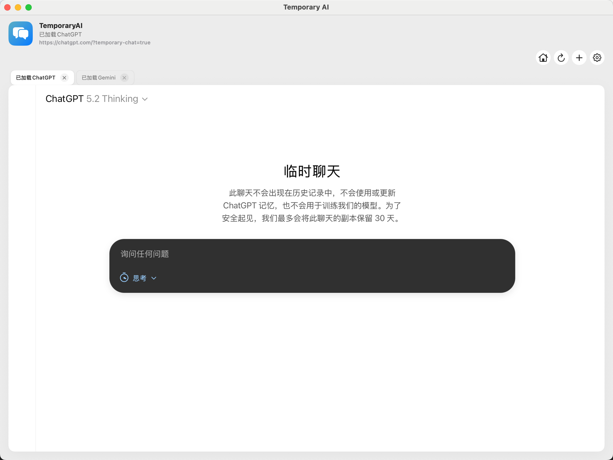

<p align="center">
  
</p>

# Temporary AI (Private ChatGPT & Gemini)

[中文文档](README_CN.md)

A native macOS application based on **SwiftUI + WKWebView**, designed for a **privacy-first** AI chat experience. It enforces "Temporary Chat" mode for AI services and actively blocks access to history, ensuring your conversations are "burn after reading."

<p align="center">
  
</p>

[User Community](screenshot/wechat_group.jpg)

## Core Features

- **Privacy First**:
    - Enforces `https://chatgpt.com/?temporary-chat=true` and Gemini's temporary mode.
    - Automatically blocks history pages (`/c/*`), sharing links, and non-whitelisted domains.
    - **Incognito Mode**: Supports non-persistent storage configuration (similar to a browser's incognito mode).
- **Multi-Tab Management**:
    - Open multiple ChatGPT or Gemini tabs simultaneously and manage them independently.
    - Sidebar-style tab switching, optimized for desktop usage.
- **Clean Interface**:
    - Injects JavaScript/CSS to automatically hide the original website's sidebar, history list, and other distractions.
    - Provides a native macOS toolbar: Refresh, Home, and Force New Chat.
- **Secure Navigation Engine**:
    - Built-in `NavigationPolicyEngine` strictly controls page navigation.
    - Clicking external links (e.g., search citations) triggers a native macOS confirmation prompt to prevent accidental exits.

## 📥 Installation

### Option 1: Build from Source (Recommended)

This is a standard Swift Package Manager (SPM) project.

**Requirements:**
- macOS 13.0+
- Xcode 15+ (or Swift 5.9+ toolchain installed)

**Steps:**
1. Clone the repository:
   ```bash
   git clone https://github.com/yourusername/Private-ChatGPT.git
   cd Private-ChatGPT
   ```
2. Build the app using the included script (handles icons and directory structure):
   ```bash
   chmod +x build_app.sh
   ./build_app.sh
   ```
3. Once built, `TemporaryAI.app` (or Chinese name `临时AI.app`) will be generated in the `build/` directory. Drag it to your "Applications" folder.

### Option 2: Xcode Debugging
1. Open the project by double-clicking `Package.swift` or running `xed .` in the terminal.
2. Select the `TemporaryAI` scheme from the top bar.
3. Configure Signing & Capabilities (select your Team).
4. Click Run (Cmd + R).

## ⚙️ Configuration & Custom Scripts

To comply with open-source policies and allow user customization, this project **does not include** proprietary JavaScript scripts for hiding the sidebar or forcing temporary sessions by default.
Compatible scripts for the current ChatGPT/Gemini UI will be released in a proper form later.

### How to Enable Interface Optimization Scripts?

In the `Sources/Resources/` directory, you will find the following example files:
- `chatgpt_default_script.js.example`
- `gemini_default_script.js.example`

By default the app **does not load any optimization scripts**, so the web UI stays unchanged unless you supply code.

**Methods:**

1. **Rename (Recommended for Developers)**:
   Rename the above files to `chatgpt_default_script.js` and `gemini_default_script.js`, and write your DOM manipulation code inside (e.g., `document.querySelector('...').style.display = 'none'`).

2. **Configure in App Settings (Recommended for Users)**:
   Launch the App, click the gear icon in the top right to enter **Settings** -> **Scripts**.
   - You can paste your JavaScript code directly here.
   - Scripts in Settings take precedence over local files.

## 🛠 Tech Stack

- **UI Framework**: SwiftUI (AppKit Lifecycle)
- **Web Kernel**: WKWebView + UserScripts (JS Injection)
- **Architecture**: MVVM
- **Key Modules**:
    - `NavigationPolicyEngine`: Decides whether each URL navigation is Allowed, Blocked, or Redirected.
    - `UserScriptManager`: Manages CSS/JS injection.
    - `TabManager`: Manages multi-tab state.

## 🤝 Contribution

Issues and Pull Requests are welcome!
If you find better DOM hiding rules or want to support new AI services, feel free to contribute.

## 📄 License

This project is licensed under the [MIT License](LICENSE).
You are free to use, modify, and distribute this project. See the LICENSE file for details.
